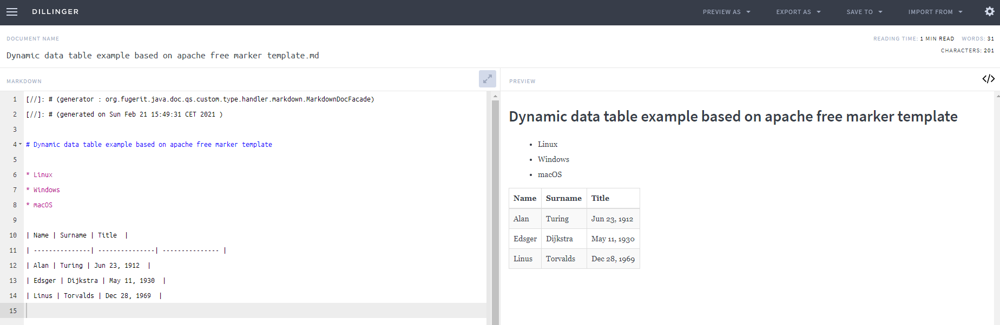

[Docs Home](../../index.md)

## QuickstartC002CustomMarkdownTypeHandler

*version : 001*

**Maven dependancies :**
* org.fugerit.java/fj-core
* org.fugerit.java/fj-doc-base
* org.fugerit.java/fj-doc-freemarker	(for both html and pdf fop handlers)
* org.fugerit.java/fj-doc-mod-fop	(for pdf fop handler)

[QuickstartC002CustomMarkdowTypeHandler](../../fj-doc-quickstart-c-advanced/src/test/java/test/org/fugerit/java/doc/qs/QuickstartC002CustomMarkdownTypeHandler.java) shows how is possible to create two custom doc type handlers from scratch :

* [CustomMarkdownBasicTypeHandler](../../type-handler-markdown-custom/src/main/java/org/fugerit/java/doc/qs/custom/type/handler/markdown/CustomMarkdownBasicTypeHandler.java) is a doc type handler for markdown basic syntax.
* [CustomMarkdownExtTypeHandler](../../type-handler-markdown-custom/src/main/java/org/fugerit/java/doc/qs/custom/type/handler/markdown/CustomMarkdownExtTypeHandler.java) is a doc type handler for markdown extended syntax.

A DocTypeHandler must inspect all elements in [DocBase](https://venusdocs.fugerit.org//fj-doc-base/src/main/java/org/fugerit/java/doc/base/model/DocBase.java) model.    
During inspection the doc meta model must be used to render actual output formats.  
DocBase model is a java representation of the xml doc source.  
In this case the inspection is implemented using [DocTypeFacadeDefault](https://venusdocs.fugerit.org/fj-doc-base/src/main/java/org/fugerit/java/doc/base/helper/DocTypeFacadeDefault.java) facility.  

* [MarkdownBasicDocFacade](../../type-handler-markdown-custom/src/main/java/org/fugerit/java/doc/qs/custom/type/handler/markdown/MarkdownBasicDocFacade.java) is a doc type handler for markdown basic syntax.
* [MarkdownExtDocFacade](../../type-handler-markdown-custom/src/main/java/org/fugerit/java/doc/qs/custom/type/handler/markdown/MarkdownExtDocFacade.java) is a doc type handler for markdown extended syntax.

Note that MarkdownExtDocFacade simply extends and change some behaviours of MarkdownBasicDocFacade.  

Here is CustomMarkdownExtTypeHandler output on a Markdown playgound :

